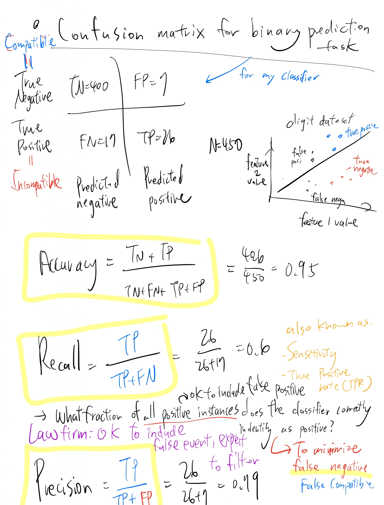
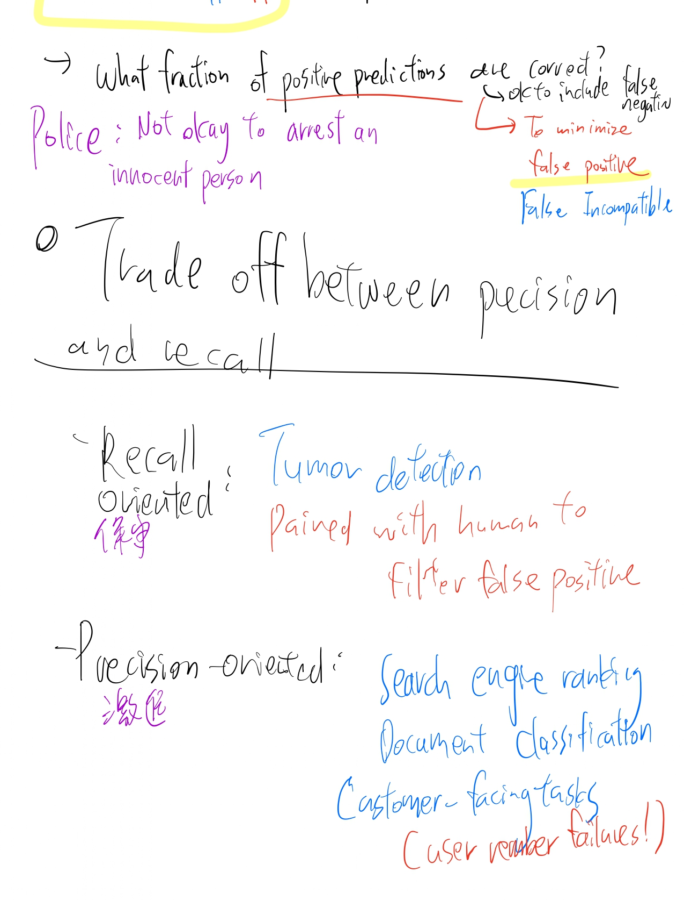
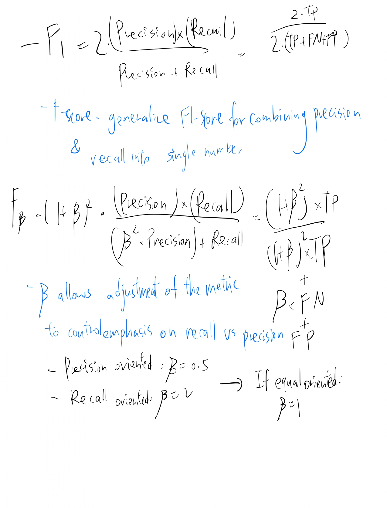

# 💊 Drug-Excipient Compatibility Prediction (Multilayer Perceptron + Mordred)

This project replicates and improves upon the methodology presented in the research paper **"Towards safer and efficient formulations: Machine learning approaches to predict drug-excipient compatibility"** (Nguyen Thu Hang et al., 2024).

While the original paper relies heavily on NLP-based approaches (Mol2Vec), this project demonstrates that **Physicochemical Descriptors (Mordred)** coupled with a **Multilayer Perceptron (MLP)** offer superior sensitivity in detecting incompatibility caused by inorganic salts and metal ions.

---

## 🏆 Key Innovation1: Why Move from Mol2Vec to Mordred?

Our initial experiments with Mol2Vec (Word2Vec for chemicals) revealed a critical limitation: **Signal Dilution.**

### The "Mg Stearate" Problem
* **Mol2Vec (NLP approach):** Views molecules as sentences. For Mg Stearate, the two long C18 carbon chains dominate the "sentence." The single Magnesium ion ($Mg^{2+}$) is treated as a rare word and its signal is drowned out by the noise of the carbon chain.
    * **Result:** The model could not distinguish Stearic Acid (Safe) from Mg Stearate (Incompatible).
* **Mordred (Physicochemical approach):** Calculates mathematical descriptors based on physical rules. It explicitly captures:
    * **Atomic Number (Z):** Mg ($Z=12$) is heavier than C ($Z=6$). Weighted autocorrelation descriptors (e.g., ATS0Z) double in value.
    * **Electrostatics:** Captures the ionic bond nature via PEOE (Partial Equalization of Orbital Electronegativity).
    * **Stoichiometry:** Correctly identifies the 1:2 acid-to-metal ratio (nAcid).
---

## ⚖️ Addressing Class Imbalance2 : SVM-SMOTE

The original dataset is highly imbalanced (9:1 ratio of Compatible to Incompatible pairs). Standard models tend to bias towards "Compatible," ignoring minority "Incompatible" cases. We implemented **SVM-SMOTE** to resolve this:

1. **Boundary Focus:** Uses an SVM algorithm to identify "borderline" samples—incompatible pairs chemically similar to compatible ones.
2. **Synthetic Generation:** Generates new synthetic examples along the decision boundary between classes.
3. **Result:** Restored training balance to **1:1**, forcing the model to learn the specific chemical triggers for incompatibility.
---

## 📊 Model Performance: Head-to-Head Comparison
 
We compared our MLP + Mordred model against the benchmarks reported in the original paper.

| Metric | Ours (MLP + Mordred) | Paper's MLP | Paper's RF | Paper's Best (Stacking) |
| :--- | :--- | :--- | :--- | :--- |
| **Accuracy** | 94.8% | 95.0% | 96.0% | 97.0% |
| **Recall (Catching Risks)** | **0.72 (Superior)** | 0.68 | 0.72 | 0.88 (Target) |
| **Precision** | 0.74 | 0.77 | 0.88 | 0.80 |
| **F1-Score** | 0.73 | 0.72 | 0.79 | 0.84 |

**Analysis:**
* Our single MLP model outperforms the paper's single MLP model in **Recall (0.72 vs 0.68)**.
* This confirms that Mordred descriptors provide a higher resolution for detecting incompatibility risks than structural fingerprints.
* **Future Goal:** Implement Stacking (Ensemble Learning) to reach the paper's best recall of 0.88.

---

# 🌐 Web Deployment Architecture (Streamlit)

The project features a high-performance web interface (`app.py`) built with **Streamlit**, enabling researchers to perform real-time compatibility screening without writing code.
 

---

## ⚙️ Workflow Pipeline

### 1. Intelligent Input Resolution
To handle the variety of chemical naming conventions, the app uses a **Dual-Strategy Fetcher**:
* **Primary:** `PubChemPy` API search by common name or CID.
* **Fallback:** `CIRpy` (Chemical Identifier Resolver) to ensure complex inorganic salts (e.g., Magnesium Aluminum Silicate) are correctly mapped to SMILES strings.

### 2. On-the-fly Feature Engineering
Once the SMILES strings are retrieved, the system processes them through the **Mordred Calculator**:
* **Real-time Generation:** Computes 2,738 descriptors instantly.
* **Standardization:** Applies a pre-loaded `StandardScaler` (fitted on the training set) to normalize features to **Mean=0** and **Std=1**.

### 3. Neural Network Inference
The normalized feature vector is passed to the trained **Multilayer Perceptron (MLP)**:
* **Output:** A continuous "Risk Score" representing the probability of incompatibility ($0.0 \rightarrow 1.0$).

---

## ⚖️ Decision Logic: Safety-First Thresholding

In pharmaceutical formulation, a **False Negative** (missing a real risk) is significantly more dangerous than a **False Positive**. To prioritize patient safety, we bypass the default 50% classification threshold.

| Logic | Condition | Visual Indicator |
| :--- | :--- | :--- |
| **Strict Risk Threshold** | **Risk Score > 25%** | 🚨 **Incompatible** |
| **Safety Margin** | **Risk Score < 25%** | ✅ **Compatible** |

> **Note:** By setting the threshold at 25%, the model acts as a "high-sensitivity" filter, ensuring that even marginal risks are flagged for human review.
---
 
 
 

# 🚀 New Progression: Feature Insight & Rigorous Validation (Feb 2026)

Moving beyond initial training metrics, we have conducted a deep dive into feature interpretability and tested the models against a challenging, newly curated external validation set.

---

## 🧬 Feature Importance Analysis (Decision Tree Interpretation)

To unlock the "Black Box" of our predictors, we utilized Decision Trees to extract the most informative Mordred descriptors.

* **Pros:** Highly interpretable and visualizable.
* **Cons:** Potential for overfitting (even after tuning).

### Top Critical API Features
For Active Pharmaceutical Ingredients (APIs), the model heavily relies on aromaticity and ring structures to determine compatibility risks.

| Rank | Feature | Description | Contribution (%) |
| :--- | :--- | :--- | :--- |
| 1 | API_nAromBond | Number of aromatic bonds | 1.40% |
| 2 | API_SRW09 | Self-Returning Walk (Topological shape) | 1.27% |
| 3 | API_naRing | Number of aromatic rings | 1.21% |
| 4 | API_Xch-6d | Chi path cluster (Connectivity) | 1.18% |
| 5 | API_SRW05 | Self-Returning Walk count 5 | 1.14% |

### Top Critical Excipient Features
For Excipients, the most predictive features relate to autocorrelation (spatial distribution of properties) and ionization potential.

| Rank | Feature | Importance Score | Global Contribution (%) |
| :--- | :--- | :--- | :--- |
| 1 | EXP_GATS1v | Geary coefficient (Van der Waals volume) | 0.344% |
| 2 | EXP_GATS3m | Geary coefficient (Mass) | 0.179% |
| 3 | EXP_AATSC0s | Avg centered Broto-Moreau (Intrinsic state) | 0.148% |
| 4 | EXP_MINsOH | Minimum atom-type E-state: -OH | 0.144% |
| 5 | EXP_AATSC1c | Avg centered Broto-Moreau (Charge) | 0.141% |

---

## 📉 External Validation Benchmarks

We evaluated three model configurations on a new, unseen external test set. This test set is significantly harder than the initial random split, offering a realistic view of model generalization.

| Model | Accuracy | Precision (Incompatible) | Recall (Incompatible) | F1-Score (Incompatible) | Support ($N$) |
| :--- | :--- | :--- | :--- | :--- | :--- |
| **RF + Mordred** | 0.61 | 0.53 | 0.51 | 0.52 | 157* |
| **RF + Mol2Vec** | 0.67 | 0.68 | 0.37 | 0.48 | 152 |
| **MLP + Mordred** | 0.62 | 0.56 | 0.29 | 0.38 | 152 |

> ⚠️ **Important Note on Data Consistency:**
> You may observe a discrepancy in sample size for the RF + Mordred model ($N=157$) compared to others ($N=152$).
>
> * **Cause:** Following a code review by Eddie, we identified and fixed a bug in the CID retrieval process.
> * **Impact:** This fix successfully recovered 4 previously unparseable samples (increasing the set from 152 to 157). We apologize for this minor inconsistency across the benchmark tables; however, the RF + Mordred results reflect the most complete dataset.

### Performance Interpretation
* **RF + Mordred** achieved the highest **Recall for Incompatibility (0.51)** among the validation tests. This aligns with our safety-first philosophy—it is better to flag potential risks than to miss them.
* **RF + Mol2Vec** had higher overall accuracy but suffered from low recall (0.37) on the minority class (Incompatible), proving it is less safe for risk screening.

---

## 🔭 Next Steps & Roadmap

1.  **UMAP Visualization:** Apply Uniform Manifold Approximation and Projection (UMAP) to map the newly added 162 validation samples onto the original training landscape (`2024_Drug_compatibility_dataset.xlsx`) to visualize domain shift.
2.  **Cluster Analysis:** Perform clustering on the Top 20 API and Excipient features identified above to detect specific chemical sub-groups prone to incompatibility.
3.  **PolyBERT Implementation:** Replace standard descriptors for polymer excipients with **PolyBERT** (GitHub: `Ramprasad-Group/polyBERT`). This should provide superior embeddings for complex polymers compared to calculating descriptors designed for small molecules.