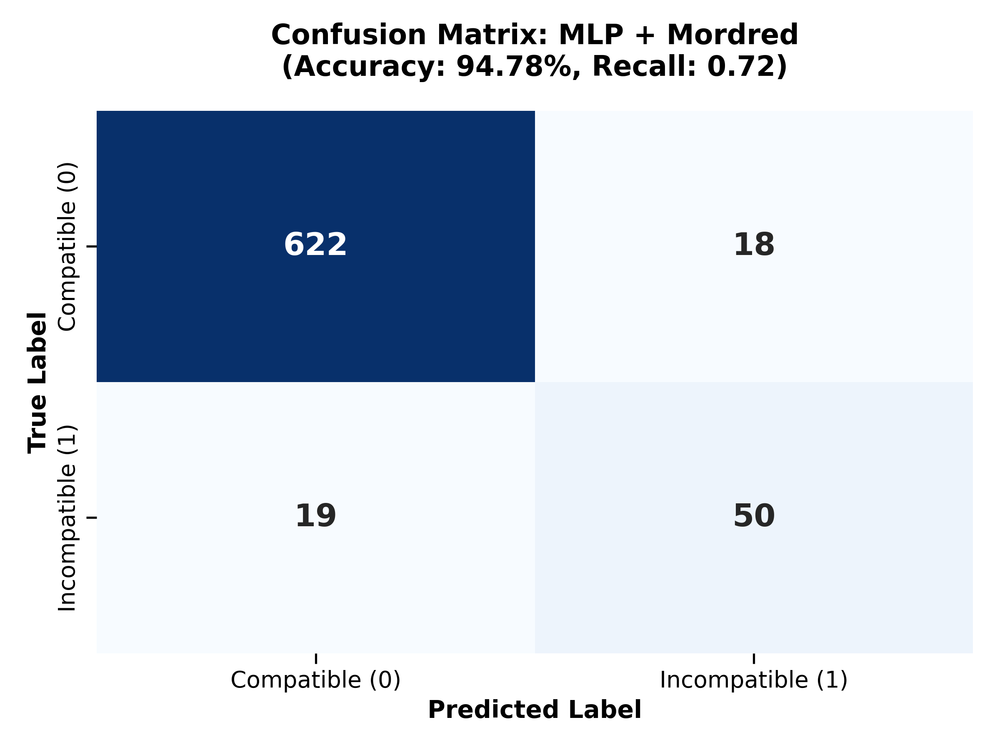

# 💊 Drug-Excipient Compatibility Prediction (Multilayer Perceptron + Mordred)

This project replicates and improves upon the methodology presented in the research paper **"Towards safer and efficient formulations: Machine learning approaches to predict drug-excipient compatibility"** (Nguyen Thu Hang et al., 2024).

While the original paper relies heavily on NLP-based approaches (Mol2Vec), this project demonstrates that **Physicochemical Descriptors (Mordred)** coupled with a **Multilayer Perceptron (MLP)** offer superior sensitivity in detecting incompatibility caused by inorganic salts and metal ions.

---

## 🏆 Key Innovation1: Why Move from Mol2Vec to Mordred?

Our initial experiments with Mol2Vec (Word2Vec for chemicals) revealed a critical limitation: **Signal Dilution.**

### The "Mg Stearate" Problem
* **Mol2Vec (NLP approach):** Views molecules as sentences. For Mg Stearate, the two long C18 carbon chains dominate the "sentence." The single Magnesium ion ($Mg^{2+}$) is treated as a rare word and its signal is drowned out by the noise of the carbon chain.
    * **Result:** The model could not distinguish Stearic Acid (Safe) from Mg Stearate (Incompatible).
* **Mordred (Physicochemical approach):** Calculates mathematical descriptors based on physical rules. It explicitly captures:
    * **Atomic Number (Z):** Mg ($Z=12$) is heavier than C ($Z=6$). Weighted autocorrelation descriptors (e.g., ATS0Z) double in value.
    * **Electrostatics:** Captures the ionic bond nature via PEOE (Partial Equalization of Orbital Electronegativity).
    * **Stoichiometry:** Correctly identifies the 1:2 acid-to-metal ratio (nAcid).
---

## ⚖️ Addressing Class Imbalance2 : SVM-SMOTE

The original dataset is highly imbalanced (9:1 ratio of Compatible to Incompatible pairs). Standard models tend to bias towards "Compatible," ignoring minority "Incompatible" cases. We implemented **SVM-SMOTE** to resolve this:

1. **Boundary Focus:** Uses an SVM algorithm to identify "borderline" samples—incompatible pairs chemically similar to compatible ones.
2. **Synthetic Generation:** Generates new synthetic examples along the decision boundary between classes.
3. **Result:** Restored training balance to **1:1**, forcing the model to learn the specific chemical triggers for incompatibility.
---

## 📊 Model Performance: Head-to-Head Comparison
 
We compared our MLP + Mordred model against the benchmarks reported in the original paper.

| Metric | Ours (MLP + Mordred) | Paper's MLP | Paper's RF | Paper's Best (Stacking) |
| :--- | :--- | :--- | :--- | :--- |
| **Accuracy** | 94.8% | 95.0% | 96.0% | 97.0% |
| **Recall (Catching Risks)** | **0.72 (Superior)** | 0.68 | 0.72 | 0.88 (Target) |
| **Precision** | 0.74 | 0.77 | 0.88 | 0.80 |
| **F1-Score** | 0.73 | 0.72 | 0.79 | 0.84 |

**Analysis:**
* Our single MLP model outperforms the paper's single MLP model in **Recall (0.72 vs 0.68)**.
* This confirms that Mordred descriptors provide a higher resolution for detecting incompatibility risks than structural fingerprints.
* **Future Goal:** Implement Stacking (Ensemble Learning) to reach the paper's best recall of 0.88.

---

## 🛠️ System Architecture

### 1. Data Pipeline
* **Dataset:** 3,544 drug-excipient pairs (replicated from source).
* **Feature Engineering:**
    * **Source:** Mordred Calculator (1,613 features per molecule).
    * **Input Vector:** API Features + Excipient Features = ~3,226 raw features.
    * **Selection:** Applied `VarianceThreshold` to remove constant columns.
    * **Final Input:** 2,738 active features representing topology, charge, and physical properties.

### 2. Model Architecture (MLP)
* **Algorithm:** Multilayer Perceptron Classifier (Neural Network).
* **Solver:** `LBFGS` (Optimized for smaller datasets with high dimensionality).
* **Scaling:** `StandardScaler` (Crucial for Mordred features which vary in scale).

### 3. Safety-First Thresholding
Standard models use a 50% probability threshold ($p > 0.5$). In pharmaceutical safety, **Recall** (avoiding false negatives) is more critical than Precision.
* **Adjustment:** We calibrated the decision threshold to **0.25 (25%)**.
* **Impact:** Any pair with $>25\%$ risk probability is flagged as "Incompatible". This aligns with the "Better Safe Than Sorry" principle.

---
 
 
 
