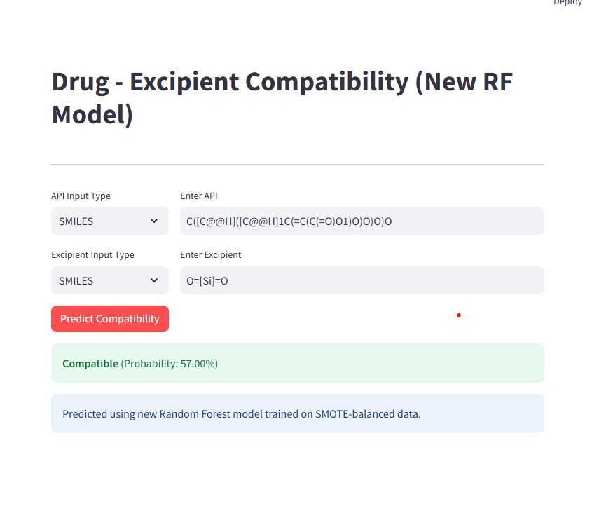

# 💊 Drug-Excipient Compatibility Prediction (DE-INTERACT Replication)

This project replicates and improves upon the methodology presented in the research paper **Towards safer and efficient formulations: Machine learning approaches to 
predict drug-excipient compatibility** (Nguyen Thu Hang et al., 2024).

The goal is to predict whether a specific Active Pharmaceutical Ingredient (API) is compatible with a specific Excipient using Natural Language Processing (Mol2Vec) and Machine Learning techniques.

---

## 🏆 Current Progression

### 1. Data Replication & Vectorization
* **Dataset:** Successfully replicated the exact dataset structure from the paper: 3,544 drug-excipient pairs (3,200 Compatible, 344 Incompatible).
* **Feature Engineering:** Implemented **Mol2Vec** (Word2Vec-based) embeddings to convert chemical structures (SMILES) into 100-dimensional vectors.
* **Total Features:** 200 dimensions per pair (100 for API + 100 for Excipient).

### 2. Addressed Class Imbalance (SVM-SMOTE)
The original dataset has a severe imbalance (9.3 : 1). We replaced the original "Threshold Moving" strategy with a data-centric approach:
* **Technique:** Applied **SVM-SMOTE** (Support Vector Machine - Synthetic Minority Over-sampling Technique) to the training set.
* **Result:** Increased minority class (Incompatible) samples from 206 to 1,920 in the training set, achieving a perfect 1:1 balance before training.

### 3. Model Training (Random Forest)
* **Algorithm:** Random Forest Classifier (optimized via Grid Search).
* **Performance:**
    * **Test Accuracy:** 94.78%
    * **F1-Score (Incompatible):** 0.73
    * **Recall (Sensitivity):** 0.72 (Successfully caught 50 out of 69 incompatible cases in the test set).


---

## 🛠️ System Architecture: How Deployment Works


The web application (`0202_model_deploy_v2.py`) uses **Streamlit** to provide a real-time inference interface.


### Step A: Structure Resolution & Standardization
* **Input Flexibility:** Users can input **SMILES**, **Common Names**, or **PubChem CIDs**.
* **API Integration:** Uses `pubchempy` to resolve names/CIDs into canonical SMILES.
* **Standardization:** Uses `RDKit` to convert SMILES into molecule objects and applies `AddHs()` to ensure hydrogen atoms are considered in the chemical environment.

### Step B: Feature Engineering (The Mol2Vec Pipeline)
* **Substructure Fragmentation:** The `MolSentence` and `mol2alt_sentence` functions (Radius 1) break each molecule into a "sentence" of chemical identifiers.
* **Vectorization:** The pre-trained `word2vec` model (`model_300dim.pkl`) transforms these identifiers into numerical space.
* **Concatenation:** * API Vector ($1 \times 100$) + Excipient Vector ($1 \times 100$) = **Feature Vector ($1 \times 200$)**.

### Step C: Inference & Probability
* **Random Forest:** The 200-dim vector is fed into `0201_my_rf_model.pkl`.
* **Decision Logic:** The model outputs a probability using `predict_proba`. Since the training data was balanced via SMOTE, a standard **0.5 threshold** is used to determine Compatibility vs. Incompatibility.

---

## 🧪 Case Study: Ascorbic Acid (Vitamin C)

We performed a "stress test" using Ascorbic Acid against 6 common excipients to compare the **Original Model** vs. the **New Model (RF + SVM-SMOTE)**.

| Excipient | Ground Truth (Mechanism) | Old Model (Original) | New Model (Ours) | Analysis |
| :--- | :--- | :--- | :--- | :--- |
| **Fluorinated Amide** | Incompatible (Hydrolysis) | Incompatible (99.5%) ✅ | Incompatible (76.81%) ✅ | Both models captured the chemical instability. |
| **Mg-Stearate** | Incompatible (Acid-Base) | Incompatible (92.4%) ✅ | Compatible (53.19%) ❌ | Borderline result; SMOTE might need more acid-base samples. |
| **SiO2** | Incompatible (Hygroscopicity) | Incompatible (83.0%) ✅ | Compatible (57.00%) ❌ | New model struggled with moisture-mediated interactions. |
| **Cellulose** | Compatible (Inert) | Incompatible (96.9%) ❌ | Incompatible (60.99%) ❌ | New model reduced FP confidence by ~35%. |
| **Stearic Acid** | Compatible (Inert) | Incompatible (96.7%) ❌ | Incompatible (69.31%) ❌ | Significantly less "alarmist" than the original model. |
| **Mannitol** | Compatible (Inert) | Incompatible (95.3%) ❌ | Incompatible (65.83%) ❌ | Bias reduced, but still influenced by minority oversampling. |

---

## 🚀 Next Steps
1.  **Data Augmentation:** Collect specific "Stability Datasets" to better represent physical degradation (Hygroscopicity/Oxidation).
2.  **Fine-Tuning:** Retrain with custom weights for specific functional groups (e.g., Carboxylic acids vs. Stearates).
3.  **LLM Extraction:** Use GPT-4o to scrape and verify 500+ new interaction pairs from pharmaceutical literature.

---

## 📦 Installation & Usage

```bash
# 1. Install dependencies
poetry install

# 2. Run the Training Pipeline
poetry run python 0201_train_rf.py

# 3. Launch the Streamlit Web App
poetry run streamlit run 0202_model_deploy_v2.py